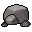
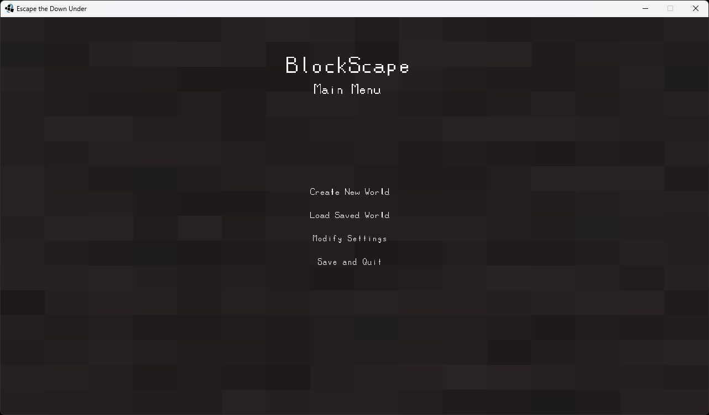
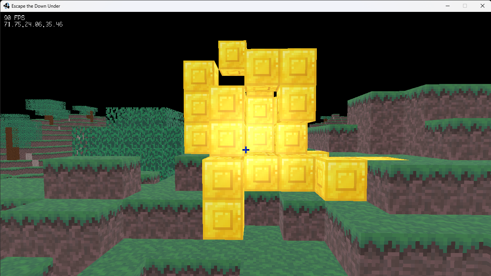

<h1 style="display: flex; flex-direction: row; align-items: center;">
  
  BlockScape
  
</h1>

## About

BlockScape is a single player 3D voxel game with infinite random terrain generation. The player finds themselves in a vast and dangerous alternate dimension, where resources and food are scarce. Can you manage to build a portal and escape, or will you perish in this hellish world?

## Status

Currently, some randomized terrain generation is implemented, but it is not the cave-like terrain the final version will have. Basic specular lighting works, but ambient occlusion needs to be added, as well as a proper lighting system.

  
  

 

The chunk system works with 16x16x16 chunks, but even at render distances as low as 24 performance is starting to take a big hit, so refactoring to use octrees might be a better alternative.

## Running

There is no released stable build yet. If you'd like to mess around with the game, you will need to download the source code, configure and run it yourself.

## To Implement

- Fix tree generation by writing into next chunk
- Add chunk saving (write binary data to save file)
- Use perlin noise to finish infinite terrain generation
- Do more chunk mesh optimization (between chunks)
- Figure out player movement and raycasting for block interaction
- Improve lighting with ambient occlusion